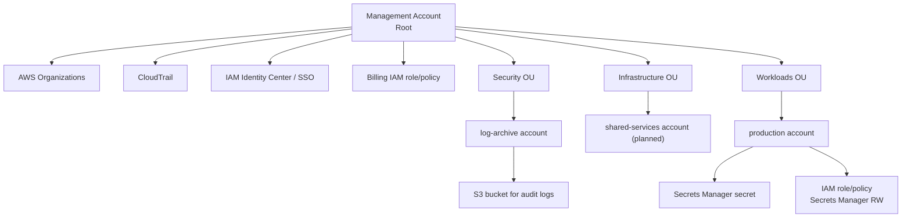

# TEST AWS Organization Baseline

This Terraform configuration provisions an AWS Organizations management account baseline with:

- AWS Organizations
- CloudTrail
- IAM Identity Center / SSO permission set
- Preparatory OUs for Security, Infrastructure, and Workloads
- Accounts for Log Archive (in the Security OU), and Production (in the Workloads OU)
- Secrets Manager and appropriate IAM policies in the Production account
- S3 bucket for CloudTrail logs in the Log Archive account
- IAM policies for billing access in the root account

## Organization Diagram




## Prerequisites

- A brand-new AWS account that will become the management account
- AWS credentials for that account (preferably the root user or a highly privileged admin role)
- Terraform 1.5+

## Usage

1. Set your AWS credentials:
   ```bash
   export AWS_PROFILE=your-profile
   # or export AWS_ACCESS_KEY_ID=... AWS_SECRET_ACCESS_KEY=...
   ```

2. Initialize Terraform:
   ```bash
   terraform init
   ```

3. Review the plan:
   ```bash
   terraform plan
   ```

4. Apply the configuration:
   ```bash
   terraform apply
   ```

## Notes

- Creating an AWS Organization is a one-time operation for the management account.
- The Terraform configuration assumes you are running it from the account that should become the management account.
- The S3 bucket name for audit logs must be globally unique; adjust the default if needed.
